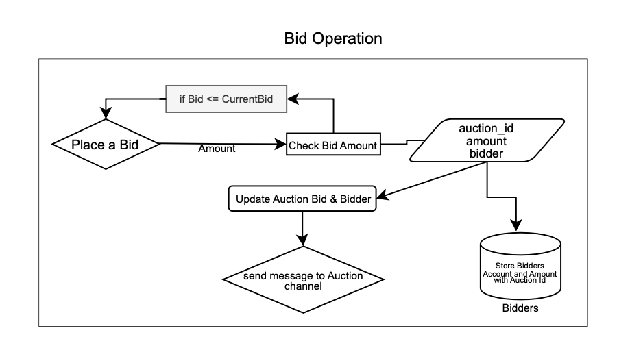
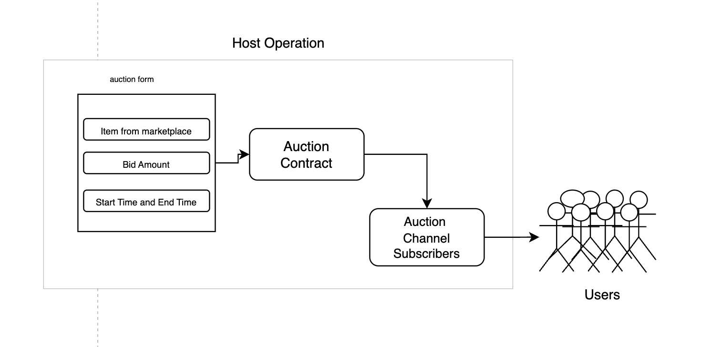
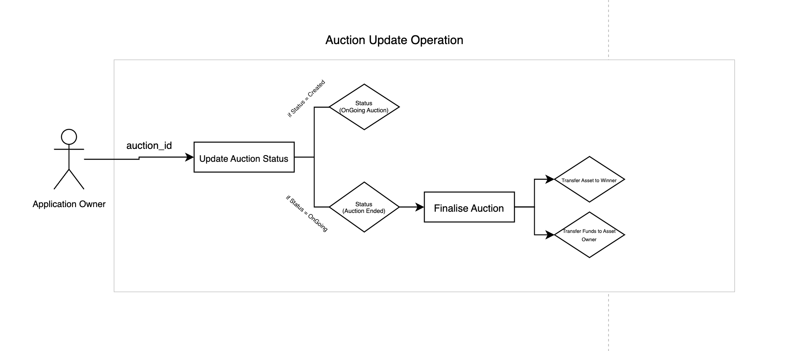

# LinLin: Auction System on Linera

LinLin is a full-stack, decentralized auction platform built on the Linera blockchain. It combines on-chain Rust smart contracts with a React/Tailwind client to let users list items, place bids in real time, and settle ownership and funds automatically.

## What this app is and does
- Full-stack auction DApp on Linera: Rust smart contracts plus a React/Tailwind client.
- Create and schedule auctions for digital or physical items with start/end windows and reserve bids.
- Bid in real time; the UI listens to GraphQL subscriptions so updates land instantly without reloads.
- Automatic state transitions (Created → Ongoing → Ended) enforced by the contract and the client watchdog.
- Secure settlement: ownership moves via the Market contract; payments are handled by the LinCoin fungible token contract.
- Multi-wallet support: the deploy script starts two Linera services on different ports for local testing.

## Tech stack
- Smart contracts: Rust + `linera_sdk` (Auction, Market, LinCoin).
- Frontend: React 18, TypeScript, Vite, Tailwind CSS, DaisyUI, Apollo Client (queries/subscriptions).
- Tooling: ESLint, TypeScript, Vite preview, Bun lockfile present (npm works too).

## Repository layout
- `auction/`, `market/`, `lincoin/`: Rust contracts for bidding, ownership transfer, and the LinCoin token.
- `client/`: React single-page app that surfaces live auctions and bidding flows.
- `assets/`: Architecture and flow diagrams used in this README.
- `deploy.sh`: Helper to spin up a Linera testnet, publish bytecode, and expose two wallet services.

## Architecture overview


Key flows:
- Bid lifecycle: 
- Hosting/creation: 
- Status updates: 

## Prerequisites
- Rust (stable) with the Wasm target: `rustup target add wasm32-unknown-unknown`
- Linera CLI (`linera`), installed and on your PATH
- Node.js 18+ (or Bun) for the frontend
- Bash (for `deploy.sh`) if running locally

## Quick start (local)
1) Build contract artifacts (from repo root):
```bash
cargo build --release --target wasm32-unknown-unknown -p lincoin -p market -p auction
```

2) Start a local testnet and publish contracts (from repo root):
```bash
bash deploy.sh
```
The script:
- Boots a Linera testnet with two wallets.
- Publishes LinCoin bytecode.
- Publishes Market and Auction apps with required IDs.
- Starts Linera services on ports `8080` (wallet 0) and `8081` (wallet 1).
Record the printed application IDs; if they differ from defaults, update `client/src/constants/const.ts`.

3) Install and run the client:
```bash
cd client
npm install         # or bun install / pnpm install
npm run dev -- --host --port 5173
```
Open http://localhost:5173.

## Using the app
- Browse auctions: see Upcoming, Ongoing, and Past sections, each sourced via GraphQL.
- Inspect and bid: click an ongoing auction to open its modal and place a bid with your connected chain/wallet.
- Host auctions: create and schedule start/end times; the client watchdog and contract keep status in sync.
- Settlement: at `Ended`, ownership transfers through the Market contract; funds move via LinCoin.

## Configuration
- Contract IDs and chain: `client/src/constants/const.ts`
- Default Linera service port for the main chain: `8080` (set in `mainPort`)
- GraphQL endpoints: derived from the Linera service URL; adjust if your service runs on a different port.

## Useful scripts
- `npm run dev` – start the React dev server
- `npm run build` – type-check and bundle the client
- `npm run lint` – lint the client

## Contracts at a glance
- Auction: creation, bidding, status transitions, escrow/settlement; GraphQL service for queries/subscriptions.
- Market: item registry and ownership transfer.
- LinCoin: fungible token used for deposits and payouts.

## Contributing / notes
- Keep the Wasm target up to date before deploying.
- If you change contract parameters, rebuild the Wasm and redeploy so IDs stay consistent with the client config.
